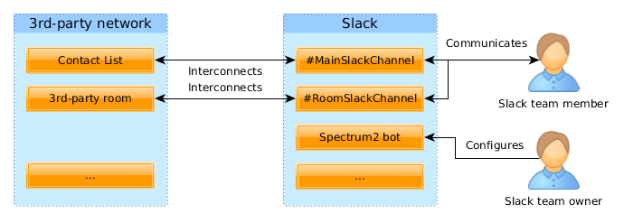

## How does Spectrum 2 interact with my team?

Spectrum 2 interconnects the Slack channels with the 3rd-party network contact list and rooms as showed in the following image:

Spectrum 2 distinguishes between two Slack team members roles:

* **The primary team owner** is able to configure interconnections between Slack channels and 3rd-party network channels and is also able to configure Spectrum 2 itself.
* **Other Slack team members** are able to write to channels and their messages are forwaded to 3rd-party network.

For networks which have the contact list (like Skype, Jabber or Twitter), there is special mapping between single Slack channel and the contact list. In the image, that channel is called **#MainSlackChannel**. The name of this channel is configured by the Primary team owner. Whatever is written to the channel is sent to all people in the 3rd-party network contact list and when some of the 3rd-party contacts write an answer, it is forwarded to this Slack channel.

For networks which support rooms (like Jabber or IRC), the Primary team owner can configure the interconnection between the 3rd-party room and Slack channel. Whatever is written to that Slack channel is forwarded to the 3rd-party room and vice-versa.
